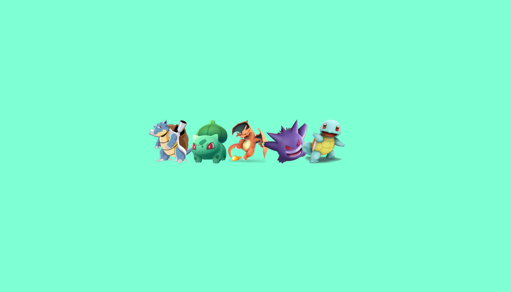

# Pokemon Hover

This project is about some pokemons that have a jumping animation this project is created on HTML and CSS

# Screen Project



# HTML

```html
<!DOCTYPE html>
<html lang="es">

<head>
    <meta charset="UTF-8">
    <meta http-equiv="X-UA-Compatible" content="IE=edge">
    <meta name="viewport" content="width=device-width, initial-scale=1.0">
    <title>Pokemon Hover</title>
    <link rel="stylesheet" href="styles.css">
</head>

<body>
    <div class="imagenes-container">
        <div class="imagen">
            
            <span class="nombre">
                <span class="text">Blastoise</span>
            </span>
        </div>
        <div class="imagen">
            
            <span class="nombre">
                <span class="text">Bulbasaur</span>
            </span>
        </div>
        <div class="imagen">
            
            <span class="nombre">
                <span class="text">Charizard</span>
            </span>
        </div>
        <div class="imagen">
            
            <span class="nombre">
                <span class="text">Gengar</span>
            </span>
        </div>
        <div class="imagen">
            
            <span class="nombre">
                <span class="text">Squirtle</span>
            </span>
        </div>
    </div>
</body>

</html>
```

# CSS

'''css
  body{
    margin: 0;
    padding: 0;
    box-sizing: border-box;
    font-family: sans-serif;
    background-color: aquamarine;
}
.imagenes-container{
    justify-content: center;
    align-items: center;
    height: 100vh;
    display: flex;
}
.imagenes-container .imagen{
    position: relative;
    margin-right: -20px;
    display: inline-flex;
    flex-direction: column;
}
.imagenes-container .imagen img{
    width: 150px;
    height: 150px;
    transition: transform 0.32s ease-in-out;
}
.imagenes-container .imagen .nombre{
    position: absolute;
    background-color: black;
    border-radius: 5px;
    color: white;
    display: none;
    min-width: 100px;
    width: 150px;
    top: -55px;
    padding: 10px 15px;
}
.imagenes-container .imagen .nombre .text{
    display: inline-block;
    text-overflow: ellipsis;
    overflow: hidden;
    white-space: nowrap;
    margin: 0 auto;
    width: 150px;
    text-align: center;
    box-sizing: border-box;
}
.imagenes-container .imagen:hover .nombre{
    display: inline-block;
    transform: translateY(-20px);
}
.imagenes-container .imagen .nombre::before{
    content: "";
    position: absolute;
    width: 1px;
    height: 1px;
    left: 40%;
    bottom: -20px;
    border-top: solid 10px black;
    border-left: 10px solid transparent;
    border-right: 10px solid transparent;
    border-bottom: 10px solid transparent;

}
.imagenes-container .imagen:hover img{
    transform: translateY(-20px);
}
@media (max-width: 680px){
    .imagenes-container {
        flex-direction: column;
        height: 120vh;
    }
}


'''
